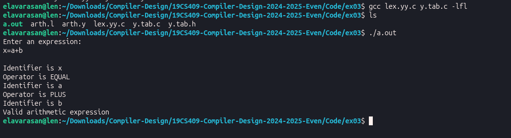

# Ex. No : 3	
# RECOGNITION OF A VALID ARITHMETIC EXPRESSION THAT USES
## Register Number : 212224040083
## Date : 25-05-2026

## AIM   
To write a yacc program to recognize a valid arithmetic expression that uses operator +,- ,* and /.

## ALGORITHM
1.	Start the program.
2.	Write a program in the vi editor and save it with .l extension.
3.	In the lex program, write the translation rules for the operators =,+,-,*,/ and for the identifier.
4.	Write a program in the vi editor and save it with .y extension.
5.	Compile the lex program with lex compiler to produce output file as lex.yy.c. eg $ lex filename.l
6.	Compile the yacc program with yacc compiler to produce output file as y.tab.c. eg $ yacc –d arith_id.y
7.	Compile these with the C compiler as gcc lex.yy.c y.tab.c
8.	Enter an arithmetic expression as input and the tokens are identified as output.

## PROGRAM

#### arth.l (Lex Program)

```c
%{
#include "y.tab.h"
#include <stdio.h>
%}

%%

"="     { printf("\nOperator is EQUAL"); return '='; }
"+"     { printf("\nOperator is PLUS"); return PLUS; }
"-"     { printf("\nOperator is MINUS"); return MINUS; }
"/"     { printf("\nOperator is DIVISION"); return DIVISION; }
"*"     { printf("\nOperator is MULTIPLICATION"); return MULTIPLICATION; }

[a-zA-Z][a-zA-Z0-9]* {
    printf("\nIdentifier is %s", yytext);
    return ID;
}

\n      { return 0; }

.       { return yytext[0]; }

%%

int yywrap()
{
    return 1;
}
```

#### arth.y (YACC Program)

```c
%{
#include <stdio.h>
#include <stdlib.h>

void yyerror(char *s);
int yylex(void);
%}

%token ID PLUS MINUS MULTIPLICATION DIVISION

%%

statement:
      ID '=' E
      {
          printf("\nValid arithmetic expression\n");
      }
      ;

E:
      E PLUS ID
    | E MINUS ID
    | E MULTIPLICATION ID
    | E DIVISION ID
    | ID
    ;

%%

int main()
{
    printf("Enter an expression:\n");
    yyparse();
    return 0;
}

void yyerror(char *s)
{
    printf("\nInvalid arithmetic expression\n");
}
```

## Steps

### Execution Steps

- Generate Lex source file

  ```bash
  flex arth.l
  ```

- Generate YACC source file

  ```bash
  yacc -d arth.y
  ```

- Compile the generated files

  ```bash
  gcc lex.yy.c y.tab.c -lfl
  ```

- Run the executable

  ```bash
  ./a.out
  ```

### Sample Input

```text
x=a+b
```
## OUTPUT 



## RESULT
A YACC program to recognize a valid arithmetic expression that uses operator +,-,* and / is executed successfully and the output is verified.
