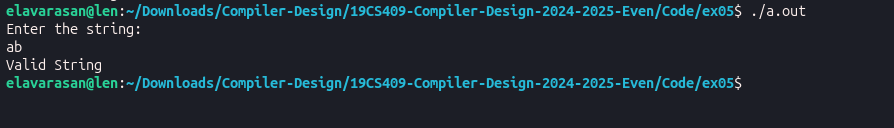

# Ex. No : 5	
# RECOGNITION OF THE GRAMMAR (a<sup>n</sup>b where n>=10) USING YACC
## Register Number : 212224040083
## Date : 26-05-2026

## AIM   
To write a YACC program to recognize the grammar a<sup>n</sup>b where n>=10.

## ALGORITHM
1.	Start the program.
2.	Write a program in the vi editor and save it with .l extension.
3.	In the lex program, write the translation rules for the variables a and b.
4.	Write a program in the vi editor and save it with .y extension.
5.	Compile the lex program with lex compiler to produce output file as lex.yy.c. eg $ lex filename.l
6.	Compile the yacc program with yacc compiler to produce output file as y.tab.c. eg $ yacc –d arith_id.y
7.	Compile these with the C compiler as gcc lex.yy.c y.tab.c
8.	Enter a string as input and it is identified as valid or invalid.
 
## PROGRAM

#### anb.l

```c
%{
#include "anb.tab.h"
%}

%%

[aA]      { return A; }
[bB]      { return B; }
\n        { return NL; }

.         { return yytext[0]; }

%%

int yywrap()
{
    return 1;
}
```

#### anb.y

```c
%{
#include <stdio.h>
#include <stdlib.h>

int yylex(void);
void yyerror(const char *s);
%}

%token A B NL

%%

stmt :
      S NL
      {
          printf("Valid String\n");
          exit(0);
      }
      ;

S :
      A S B
    |
      /* empty */
    ;

%%

int main()
{
    printf("Enter the string:\n");
    yyparse();
    return 0;
}

void yyerror(const char *s)
{
    printf("Invalid String\n");
    exit(0);
}
```


## Execution Steps

- Generate Bison files

  ```bash
  bison -d anb.y
  ```

- Generate Flex file

  ```bash
  flex anb.l
  ```

- Compile

  ```bash
  gcc lex.yy.c anb.tab.c -lfl
  ```

- Run

  ```bash
  ./a.out
  ```


## OUTPUT 




## RESULT
The YACC program to recognize the grammar anb where n>=10 is executed successfully and the output is verified.

